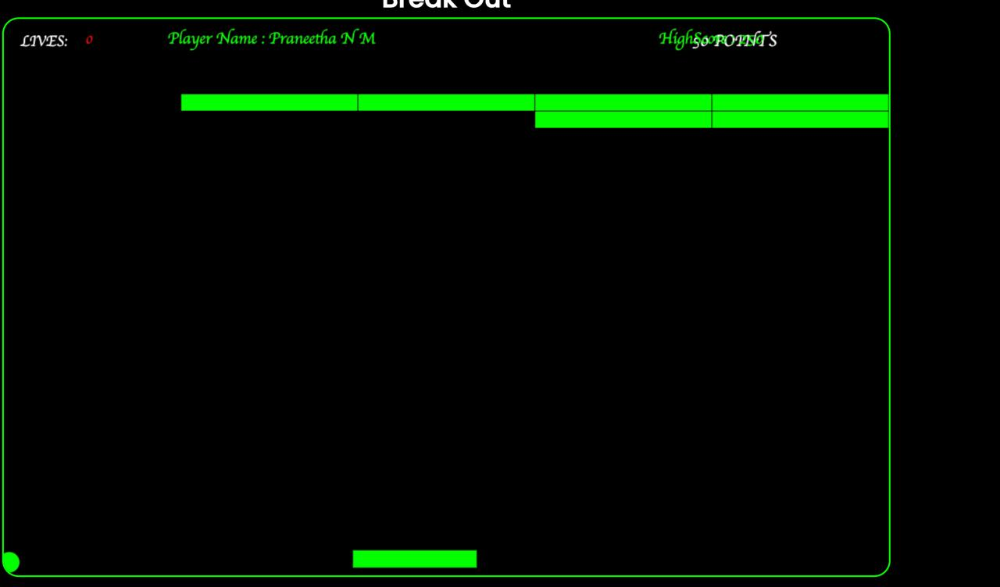
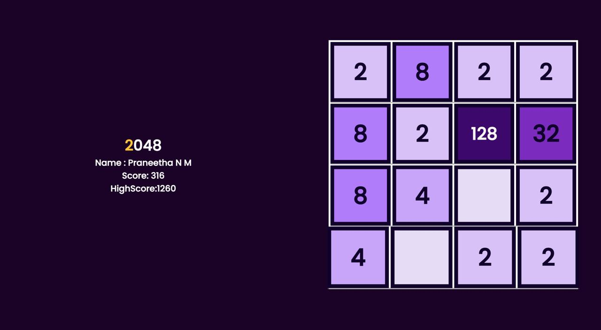
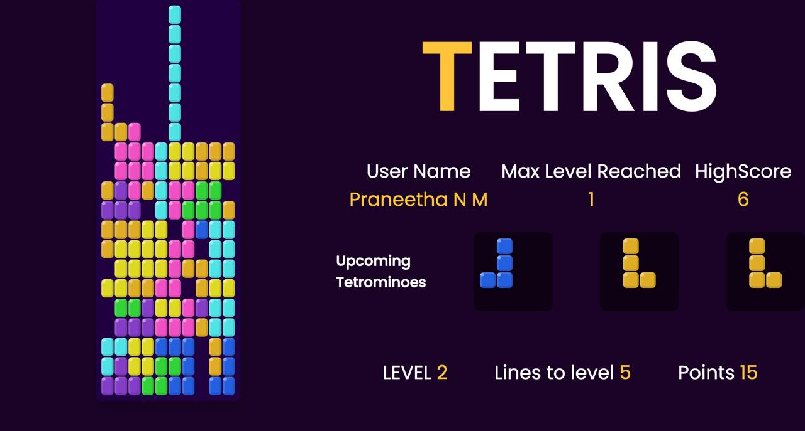
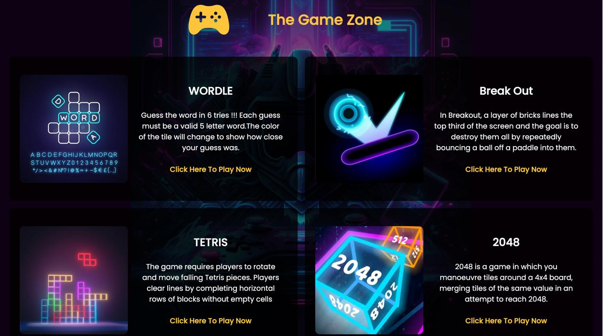
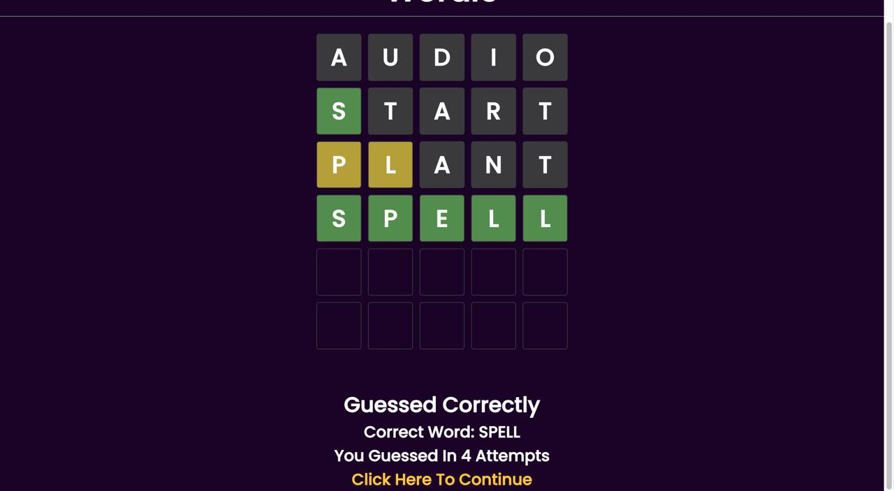

## GameVerse

GameVerse is a gaming application that lets users play a variety of classic games, including 2048, Breakout, Tetris, and Wordle. The application is designed for an engaging gaming experience, using React for the frontend, Node.js for the backend, and MongoDB for data storage. Players can compete for high scores and enjoy the games in a user-friendly interface.

## Output:








## Features

- **Multiple Games**: Play 2048, Breakout, Tetris, and Wordle.
- **Leaderboards**: Track and compete for high scores.
- **Modern Tech Stack**: Developed with React for the frontend, Node.js for the backend, and MongoDB for data storage.
- **Simple Interface**: Clean and intuitive UI for seamless gaming.

## Installation

### Cloning the Repository

To get started, clone the repository:

```bash
git clone https://github.com/Praneetha-NM/GameVerse.git
```

### Frontend Setup (React)

1. Navigate to the root directory (where the React frontend is located):
   ```bash
   cd GameVerse
   ```

2. Install the required dependencies for the frontend:
   ```bash
   npm install
   ```

3. Start the React development server:
   ```bash
   npm start
   ```

   This will launch the frontend in your browser.

### Backend Setup (Node.js)

1. Navigate to the `backend` directory:
   ```bash
   cd backend
   ```

2. Install the required dependencies for the backend:
   ```bash
   npm install
   ```

3. Set up the environment variables by creating a `.env` file in the `backend` directory and configuring your MongoDB URI.

4. Start the backend server:
   ```bash
   node index.js
   ```

   This will start the server and make the application functional.

## Technologies Used

- **Frontend**: React
- **Backend**: Node.js, Express
- **Database**: MongoDB
